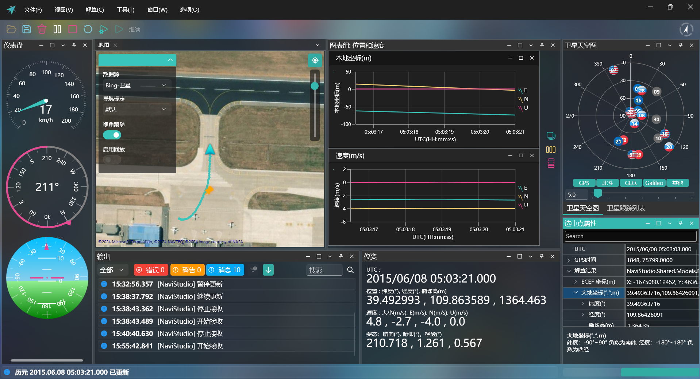
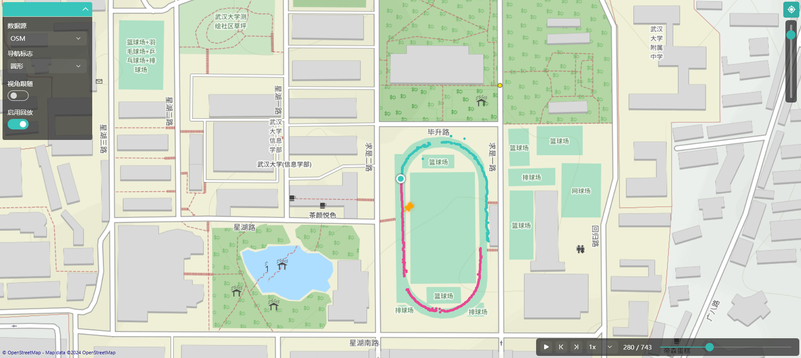
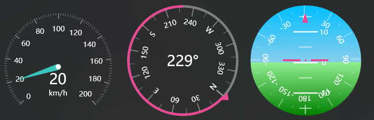
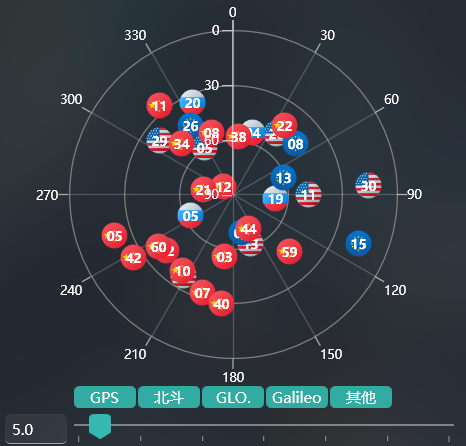
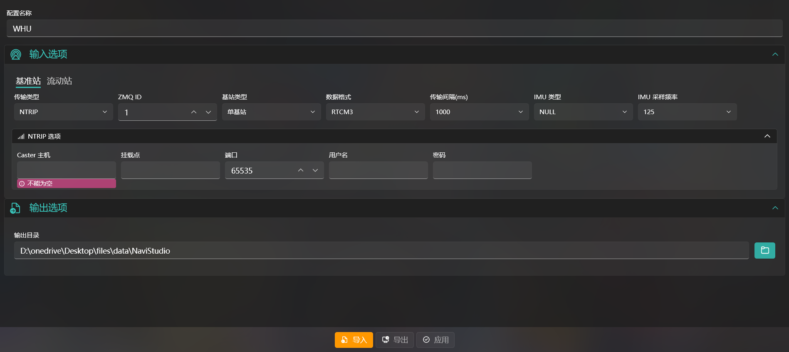
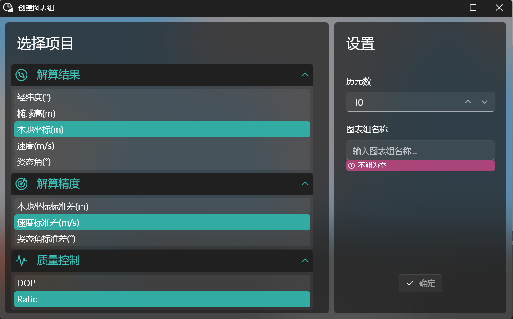
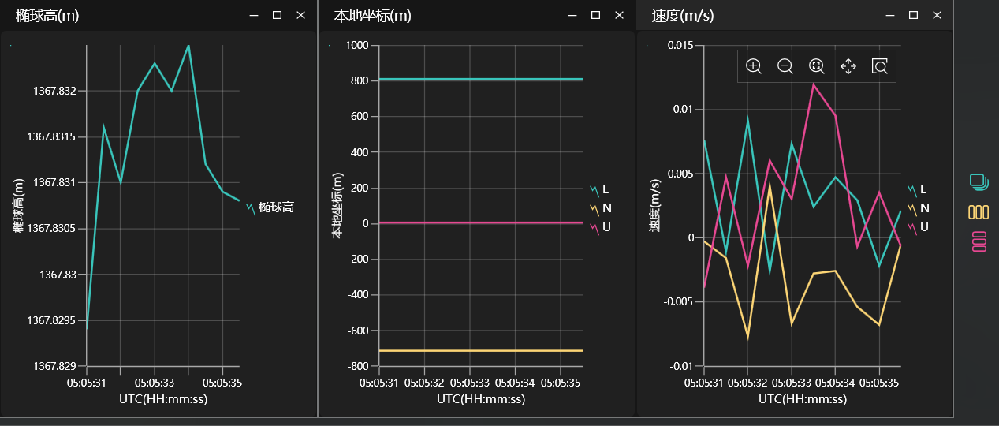

# NaviStudio
本科毕业设计项目，不实现导航算法，只是对接收到的导航结果和精度进行可视化，支持实时组合导航。部分窗口和页面 UI 如下图所示：
## MainWindow

")
")
")
")
## MapPage

## DashboardPage

## SatelliteSkyPage

## RealTimeOptionsPage

## ChartToolWindow

## ChartGroupPage

